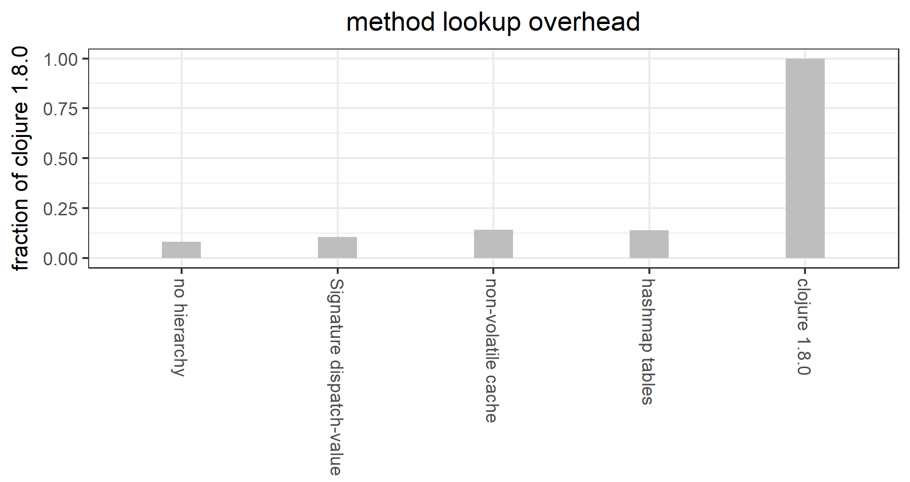

# multimethod-experiments

Experiments with implementation and design variations related to
Clojure's `defmulti`/`defmethod`/`MultiFn`.

This repository is intended as something like reproducible research,
to document in detail what led to the more stable library in 
[faster-multimethods](https://github.com/palisades-lakes/faster-multimethods)
(available from [Clojars](https://clojars.org/palisades-lakes/faster-multimethods)).

## Background

Clojure provides about a dozen competing 
variations on 'object-oriented' or 'polymorphic' functionality, 
including:
`definterface`, `defmulti`/`defmethod`, multi-arity `defn`,
`defprotocol`, `defrecord`, `defstruct`, `deftype`, 
`gen-class`, `reify`, and `proxy`.
See Chas Emerick's [Flowchart for choosing the right Clojure type definition form](https://cemerick.com/2011/07/05/flowchart-for-choosing-the-right-clojure-type-definition-form/) 
for a comparison and evaluation of when to use which.
(Note that it doesn't include `defmulti`/`defmethod`.)

Of the non-deprecated ones, `defmulti`/`defmethod` seems to one of 
the least used (though I have no hard data for that). 
This may in part be due to the general advice on the web, 
which is to use `defprotocol` rather than `defmulti`, because
`defmutli` is 'slow' by comparison.

The motivation for this project was, first, to create some realistic
enough benchmarks (at least for the kinds of problems I work on)
to measure the cost of using `defmulti`  versus various alternatives.
Second, I wanted to understand the current Clojure implementation.
Third, I was curious whether significant performance improvements
can be achieved with small changes to the existing implementation,
provided as a library layered on top of Clojure,
or would compiler level changes be required.

## Main results (so far)

It turns out that it fairly easy to modify the Clojure 1.8.0 
version of multimethods
to reduce method lookup overhead by more than a factor of 10.

For the initial release, there is a single benchmark testing for
set intersection among `double` and `int` intervals and
instances of `java.util.Set` that happen to contain only numbers.

This is a much reduced version of common geometric/geospatial
operations, reduced to make it easier to focus on method lookup
overhead.

This benchmark may very well not measure anything of interest to
you. I am eager to incorporate other benchmarks, that reflect other
usage patterns --- one of the main reasons for making this
open source. 

On my Thinkpad P70 (Xeon E3-1505M v5): 

* Repeatedly calling the same method (`IntegerInterval` vs 
`IntegerInterval`), 
averages about 15ns for the intersection test itself,
500ns for Clojure 1.8.0 multimethod lookup overhead,
but about 10ns overhead for method lookup with 
the fastest option from 
[faster-multimethods](https://github.com/palisades-lakes/faster-multimethods).

* Calling 1 out of 9 methods at random 
(`IntegerInterval` vs `DoubleInterval` vs `java.util.Set`),
method lookup plus the intersection test
costs about 40ns for handcrafted Java if-then-else dispatching, 
80ns for the fastest option from [faster-multimethods](https://github.com/palisades-lakes/faster-multimethods),
and about 600ns for Clojure 1.8.0 multimethod lookup.

* The primary change is to replace the use of Clojure collections
with `java.util` equivalents, taking care to act as though those 
collections were immutable. 

* The other significant change is to optimize an important special
case: dispatch on Java classes only, foregoing the flexibility
of general hierarchies.



## More info

For general background on generic functions (aka multimethods), 
from my perspective, 
see [generic_functions](docs/generic_functions.md).

For notes on the Clojure 1.8.0 implementation,
see [Clojure 1.8.0 multimethods](docs/implementation_notes_1.8.0.md).

For descriptions of current benchmarks, and results, 
see [benchmarks](docs/benchmarks.md).

## Usage

The [benchmark scripts](src/scripts/clojure) are intended to be 
edited to address the issue you are investigating.

You can run them however you like. 

One way is to use (modifying for your environment)
[clj.bat](clj.bat), a sample Windows `cmd` script that sets up
the class path and invokes `clojure.main` on it's first argument.
For example:
```
clj src\scripts\clojure\defmultix\intersects\bench.clj
```

Also note [table.clj](src/scripts/clojure/defmultix/intersects/table.clj),
which
can be used to summarize the benchmark results in a table written to a tab-separated text file.

## Installation

Clone the repository and build from source using Maven, 
for example: 
```
mvn package
```

## License

Copyright © 2017 John Alan McDonald <palisades dot lakes at gmail dot com>

[Apache 2.0](LICENSE)

## Acknowledgements

### 

YourKit is kindly supporting open source projects with its full-featured Java
Profiler.

YourKit, LLC is the creator of innovative and intelligent tools for profiling
Java and .NET applications. Take a look at YourKit's leading software products:

* <a href="http://www.yourkit.com/java/profiler/index.jsp">YourKit Java Profiler</a> and
* <a href="http://www.yourkit.com/.net/profiler/index.jsp">YourKit .NET Profiler</a>.


