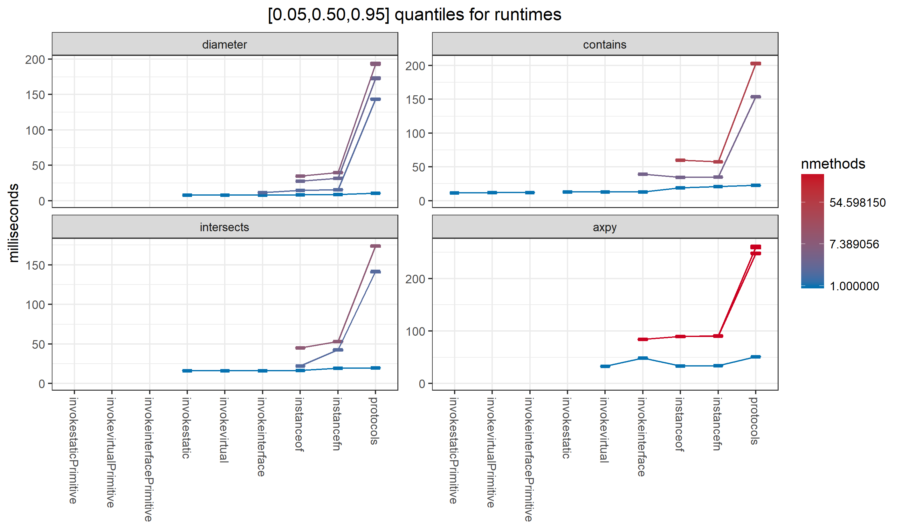

# multimethod benchmarks

A benchmark for multimethods (or anything else) only matters to you
if the pattern of use it embodies is similar to yours.
There's only one benchmark so far, and it naturally reflects
my interests. I'd like to add benchmarks the better reflect
other domains, and would appreciate help in that direction.
 
The amount of method lookup overhead you can tolerate depends on 
the cost of the operation.
So far, I'm getting roughly 500ns for 
Clojure 1.8.0 multimethod lookup;  
if you are using Clojure's multimethods to invoke methods
that take milliseconds to run, the Clojure 1.8.0 implementation
is fine.

I'm interested in using multimethods for basic basic geometric
computation. Many important methods will just be a few floating
point operations, costing perhaps 10-100 nanoseconds. 
The first benchmark (see below) is designed to reflect this.

[Criterium](https://github.com/hugoduncan/criterium)
is used to run the benchmarks, producing quantile intervals
as well as the mean.

Despite the work criterium does to stabilize the results,
I've found typically about a 10% variation in the mean
from run to run, more more than would be expected if the
criterium samples were close to independent and identically 
distributed. _I don't know why this is, and would appreciate 
suggestions._ One possibility is that it is related to
temperature dependent cpu clock throttling,
but I haven't had the chance to explore this in depth.

The bottom line is that differences in the results less than 10%
or so shouldn't be taken seriously, which is no doubt true in any case.

## general assumptions

Current assumptions underlying my choice of benchmarks.

- I want to use generic operations for everything. 
An ideal language would permit defining new methods for 
`(+ a b)` without losing any performance when `a` and `b` are 
primitive `int`. (Lexical type hints might be required, but should
have minimal scope and affect only performance and not semantics,
except that it might be useful if type hints generate runtime
assertions in some cases, causing different exceptions to be 
thrown when an assumption is violated.)

- Methods can be added/redefined dynamically, in multiple threads,
concurrent with method lookup and invocation.

- Operations are invoked much more often than methods are defined,
at least 10<sup>6</sup> times.

- A typical operation has 10s of methods, less often 100s, rarely
much more.

- Concurrent performance is critical. Multi-threaded map-reduce
operations are ubiquitous.

- The correct method is usually the same as the one used in the
most recent call, or at least the most recent call in the same thread.

- Simple argument lists (no destructuring) are good enough, or, 
at least, performance is more important in that case.

- Performance for small arities (1,2,3,..) are more important than
larger ones.

- Pure class-based method definition and lookup is more important
than general hierarchies, or, at least, performance is more
critical in that case.

## geometric set intersection test

I've chosen a reduced (1d) version of a common computational 
geometry / geospatial data task: testing for the intersection
of 2 geometric objects. This is reasonably representative of work
I do, at the low end of individual method runtime.

The basic benchmark takes as input 2 arrays of sets,
and counts the number of pairs of corresponding elements that
intersect. The individual benchmarks differ in whether all
elements of the array are the same class, 
the element class is chosen in some deterministic pattern,
or the element type is chosen at random,
giving different probabilities for invoking the same method
repeatedly, checking the performance of various 
method caching strategies
with differing probabilities of cache hit/miss.

The basic benchmark actually runs on `nthreads` pairs of arrays,
concurrently in `nthreads` threads, 
because it's not realistic to assume a multimethod will be called 
in a single thread, and
contention for shared mutable method tables might have a significant
effect, depending on implementation.

The [default](https://github.com/palisades-lakes/benchtools/blob/master/src/main/clojure/benchtools/core.clj#L42)
 for `nthreads` is 
```clojure
(max 1 (- (.availableProcessors (Runtime/getRuntime)) 2))
```
the idea being to leave one physical cpu free for system tasks,
gc, etc., perhaps reducing the variation in time between runs.

### data

Three kinds of 'geometric' sets 
(from [benchtools](https://github.com/palisades-lakes/benchtools))
are used: 

1. half-open intervals on the real line, specified with 
[`int` valued endpoints](https://github.com/palisades-lakes/benchtools/blob/master/src/main/java/benchtools/java/sets/IntegerInterval.java)

2. half-open intervals with 
[`double` valued endpoints](https://github.com/palisades-lakes/benchtools/blob/master/src/main/java/benchtools/java/sets/DoubleInterval.java)

3. instances of [java.util.Set](https://docs.oracle.com/javase/8/docs/api/index.html?java/util/Set.html)
that happen to contain only instances of `Number`.

With 3 kinds of sets, there are 9 methods to define, as in
[multix.sets.multi/intersects?](https://github.com/palisades-lakes/multimethod-experiments/blob/master/src/main/clojure/multix/sets/multi.clj)

Random sets are created by repeated calls to zero argument _set generator_ functions.
The set generators are constructed by calling functions from 
[benchtools.random.generators](https://github.com/palisades-lakes/benchtools/blob/master/src/main/clojure/benchtools/random/generators.clj).
The constructors take a number generator and return a set generator.

A _number generator_ is a zero argument function that returns a
(usually different) number every time it is called.
Functions that create pseudo-random number generators are found in 
[benchtools.random.prng](https://github.com/palisades-lakes/benchtools/blob/master/src/main/clojure/benchtools/random/prng.clj).
The number generators are explicitly seeded so that repeated runs
of the same benchmark are reproducible --- as long as the order
of data generation doesn't change.

### primary script

The main benchmark script is 
[multix.scripts.bench](https://github.com/palisades-lakes/multimethod-experiments/blob/master/src/scripts/clojure/multix/intersects/bench.clj).
It has 3 parts:

1. Baseline evaluation, including implementations
with pure static (compile-time) method lookup,
with 100% repeated calls to the same 'method'.

2. All dynamic lookup; first argument is always `IntegerInterval`;
2nd chosen at random from `IntegerInterval` and `DoubleInterval`,
so the same method is repeated 50% of the time.

3. All dynamic lookup; 1st and 2nd arguments are chosen at random
from `IntegerInterval`, `DoubleInterval`, and `SingletonSet`,
so there is 1/9 chance of repeating the same method.

[bench](https://github.com/palisades-lakes/multimethod-experiments/blob/master/src/scripts/clojure/multix/intersects/bench.clj).
calls functions defined in 
[multix.scripts.defs](https://github.com/palisades-lakes/multimethod-experiments/blob/master/src/scripts/clojure/multix/intersects/defs.clj).

### baselines

The purpose of the benchmarks here is to measure method lookup
overhead. So we have to decide 'overhead relative to what'?

One possibility is to compare a multimethod implementation
to regular Java method invocation, which requires the type of at
least one of the sets to be known at compile time.

The baseline benchmark is evaluated on 
pairs of `IntegerInterval[]` arrays, so both the types 
of both arguments are known at compile time, so it's possible
to compare static and dynamic method lookup.

The JVM has 3 instructions for calling method 
(Java 8 can't directly generate code using `invokedynamic`):
<dl>
<dt><code>invokestatic</code></dt>
<dd>
Uses static methods from 
<a href="https://github.com/palisades-lakes/benchtools/blob/master/src/main/java/benchtools/java/sets/Intersects.java">
<code>benchtools.java.sets.Intersects</code></a>.
Assumes both set classes are <code>IntergerInterval</code>,
which is known at compile time.
</dd>
<dt><code>invokevirtual</code></dt>
<dd>
Uses instance methods called from 
<a href="https://github.com/palisades-lakes/benchtools/blob/master/src/main/java/benchtools/java/sets/Sets.java">
<code>benchtools.java.sets.Sets</code></a>.
Assumes both set classes are <code>IntergerInterval</code>,
which is known at compile time.
</dd>
</dd>
<dt><code>invokeinterface</code></dt>
<dd>
Uses instance methods called from 
<a href="https://github.com/palisades-lakes/benchtools/blob/master/src/main/java/benchtools/java/sets/Sets.java">
<code>benchtools.java.sets.Sets</code></a>.
Assumes the first argument is an instance of the 
<a href="https://github.com/palisades-lakes/benchtools/blob/master/src/main/java/benchtools/java/sets/Set.java">
<code>benchtools.java.sets.Set</code></a>
interface and the second is <code>IntergerInterval</code>,
known at compile time.
</dd>
</dl>

If we believe that we need dynamic method lookup,
the above functions aren't options 
(though it's useful to get an idea whether the restrictions
of static method lookup have much value at all).

Probably the fastest way to provide dynamic lookup in Java
is a hand-coded if-then-else using </code>instanceof</code> and casting
to </code>invokevirtual</code> or </code>invokestatic</code> the right method.
</code>if-then-else instanceof</code>, which calls
[Intersects/manual](https://github.com/palisades-lakes/benchtools/blob/master/src/main/java/benchtools/java/sets/Intersects.java#L82),
does just this.

_TODO: Write system details to data folder._

The results that follow are from a Thinkpad P70 (Xeon E3-1505M v5).

The plots show 90% intervals for the runtimes for 
all 6 concurrent runs of intersection counting over
`IntegerInterval[]` arrays of length 2<sup>22</sup> (4194304)
the baseline methods vs Clojure 1.8.0 multimethods are:


The baseline methods by themselves:



_TODO: better table formatting. clojure/hiccup rather than in R?_

_TODO: automate including the tables in the markdown?_

milliseconds for 4194304 intersection tests:

|algorithm               |   0.05|   0.50|   0.95|   mean| 
|:-----------------------|------:|------:|------:|------:| 
|invokestatic            |   67.5|   67.9|   71.2|   69.2| 
|invokevirtual           |   69.1|   69.7|   70.3|   69.8| 
|invokeinterface         |   67.7|   67.9|   69.3|   68.5| 
|if-then-else instanceof |   69.0|   69.7|   73.0|   70.4| 
|clojure 1.8.0           | 1865.2| 1877.9| 1883.2| 1872.3|

There's no significant difference among `invokestatic`, 
`invokevirtual`, `invokeinterface`. and `if-the

  +n-else instanceof`.

Clojure 1.8.0 multimethods take about 27 times as long as any of the
others, implying about 95% of the time is overhead.

### dynamic lookup with 1/1 repeats

This is the same as the previous benchmark, except I add
a number of fully dynamic multimethod implementations for comparison.

The multimethod implementations include 
`if-then-else instanceof` 
and `clojure 1.8.0` as outer bounds,
and a series of backward compatible changes to the Clojure 1.8.0
multimethod implementation.
See [implementation notes 1.8.0](https://github.com/palisades-lakes/multimethod-experiments/blob/master/docs/implementation_notes_1.8.0.md) 
for
more information on Clojure 1.8.0 multimethods, 
and [faster-multimethods](https://github.com/palisades-lakes/faster-multimethods) 
for more information on the changes.
<dl>
<dt><code>hashmap tables</code></dt>
<dd> In
<a href="https://github.com/clojure/clojure/blob/master/src/jvm/clojure/lang/MultiFn.java">
<code>MultiFn</code></a>,
replace 
<a href="https://github.com/clojure/clojure/blob/master/src/jvm/clojure/lang/PersistentHashMap.java">
<code>PersistentHashMap</code></a>
with 
<a href="https://docs.oracle.com/javase/8/docs/api/java/util/HashMap.html">
<code>java.util.HashMap</code></a>,
for the <code>methodTable</code> (maps dispatch values to a defined methods),
<code>preferTable</code> (resolves multiple applicable defined methods),
and <code>methodCache</code> (maps an actual dispatch value 
to the resolved applicable method),
acting as though <code>HashMap</code> was immutable.

This is an invisible change.
</dd>
<dt><code>non-volatile cache</code></dt>
<dd>
Make the <code>methodCache</code> non-volatile.
This change may cause redundant cache updates, but I believe
that's sufficiently low probability to not affect any
performance gain, and, in any case, the cache should converge
quickly to a stable state.

This is an essentially invisible change.
</dd>
<dt><code>Signature dispatch-value</code></dt>
<dd>
I've chosen to add support for an additional special case of
dispatch values, which I call 
<a href="https://github.com/palisades-lakes/faster-multimethods/tree/master/src/main/java/faster/multimethods/java/signature">
<code>signatures</code></a>
--- essentially short immutable lists of Classes,
no Symbols or Keywords, no arbitrary hierarchy, and no recursion.
    
This is backwards compatible; and can be adopted by changing
the dispatch function from, eg, <code>[(class a) (class b)]</code> to
<code>(signature a b)</code>.
</dd>
<dt><code>no hierarchy</code></dt>
<dd>
Permit a </code>:hierarchy false</code> option to </code>defmulti</code>.
Every Clojure 1.8.0 
<a href="https://github.com/clojure/clojure/blob/master/src/jvm/clojure/lang/MultiFn.java">
<code>multimethod</code></a>
depends on an external, shared, mutable hierarchy.
Every invocation has to first check whether the hierarchy has changed
since the </code>methodCache</code> was last updated, and that check adds 
overhead. 
I believe many uses of multimethods define methods only for
classes, so the hierarchy is unused and that check is unnecessary. 

This is backwards compatible,
</dd>
</dl>

milliseconds for 4194304 intersection tests:

|algorithm                |   0.05|   0.50|   0.95|   mean|
|:------------------------|------:|------:|------:|------:|
|invokestatic             |   67.5|   67.9|   71.2|   69.2|
|invokevirtual            |   69.1|   69.7|   70.3|   69.8|
|invokeinterface          |   67.7|   67.9|   69.3|   68.5|
|if-then-else instanceof  |   69.0|   69.7|   73.0|   70.4|
|no hierarchy             |  118.0|  121.1|  125.7|  122.2|
|Signature dispatch-value |  150.2|  155.1|  159.1|  154.8|
|non-volatile cache       |  279.5|  281.4|  298.7|  287.8|
|hashmap tables           |  256.6|  263.7|  274.9|  265.1|
|clojure 1.8.0            | 1865.2| 1877.9| 1883.2| 1872.3|

The plots show 90% intervals for the runtimes for 
all 6 concurrent runs of intersection counting over
arrays of length 2<sup>22</sup> (4194304):


Excluding Clojure 1.8.0 to make the comparison among the rest easier::


### dynamic lookup with 1/2 repeats

In this benchmark, the first interval array is `IntegerInterval[]`;
the 2nd is `Object[]` and its elements are randomly chosen
from `IntegerInterval` and `DoubleInterval`.
This means the probability of repeating the same method twice in a
row in 0.5.
It also means that `invokestatic`, etc., can't be included,
because the type of the 2nd argument is not known at compile time.

milliseconds for 4194304 intersection tests:

|algorithm                |   0.05|   0.50|   0.95|   mean|
|:------------------------|------:|------:|------:|------:|
|if-then-else instanceof  |   90.8|   91.4|   94.4|   92.2|
|no hierarchy             |  181.6|  187.2|  190.0|  186.5|
|Signature dispatch-value |  203.1|  207.1|  211.2|  207.6|
|non-volatile cache       |  385.9|  412.8|  416.3|  400.9|
|hashmap tables           |  326.9|  336.8|  349.0|  336.9|
|clojure 1.8.0            | 1853.1| 1874.3| 1885.0| 1868.9|

The plots show 90% intervals for the runtimes for 
all 6 concurrent runs of intersection counting over
arrays of length 2<sup>22</sup> (4194304):


Excluding Clojure 1.8.0 to make the comparison among the rest easier::


### dynamic lookup with 1/9 repeats

This benchmark is evaluated on pair of `Object[]` arrays,
where the elements in each array are chosen with equal
probability from `IntegerInterval`, `DoubleInterval`,
and `java.util.Set`, so that the probability of a repeated best
method is 1/9.

milliseconds for 4194304 intersection tests:

|algorithm                |   0.05|   0.50|   0.95|   mean|
|:------------------------|------:|------:|------:|------:|
|if-then-else instanceof  |  149.6|  152.5|  154.7|  152.1|
|no hierarchy             |  329.5|  338.7|  342.9|  336.2|
|Signature dispatch-value |  394.6|  402.0|  409.8|  402.2|
|non-volatile cache       |  489.4|  504.6|  516.0|  500.7|
|hashmap tables           |  487.8|  503.4|  541.5|  509.7|
|clojure 1.8.0            | 2424.6| 2439.4| 2463.6| 2443.1|

The plots show 90% intervals for the runtimes for 
all 6 concurrent runs of intersection counting over
arrays of length 2<sup>22</sup> (4194304):


Excluding Clojure 1.8.0 to make the comparison among the rest easier::


### conclusions

1. All the methods take longer as the probability of calling
the same method again decreases. 
2. Replacing `PersistentHashMap` with `HashMap` 
reduces method lookup overhead to 10-15% of Clojure 1.8.0.
3. Making the `methodCache` non-volatile makes no difference
in this benchmark, if not actually making things worse.
It may help when there is more contention, possibly if `nthreads`
uses all available cpus.
4. Using a specialized `Signature` dispatch value in place
of a `PersistentVector` reduces the overhead to 5-10% of Clojure 1.8.0.
5. Providing a `:hierarchy false` option gets us to 3-8% of 
the overhead of Clojure 1.8.0.
6. The best results so far take about 1.7-2.2 times
as long as the if-then-else baseline,
so the _overhead_ is comparable to than the baseline cost.
So there is still room for improvement.
The next question is whether significant additional improvement
can be made at the Clojure/Java level, or if Clojure compiler
changes are needed.

