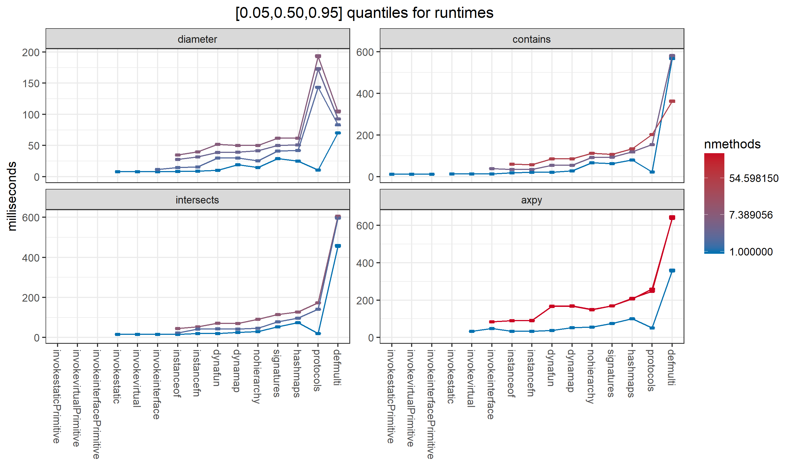
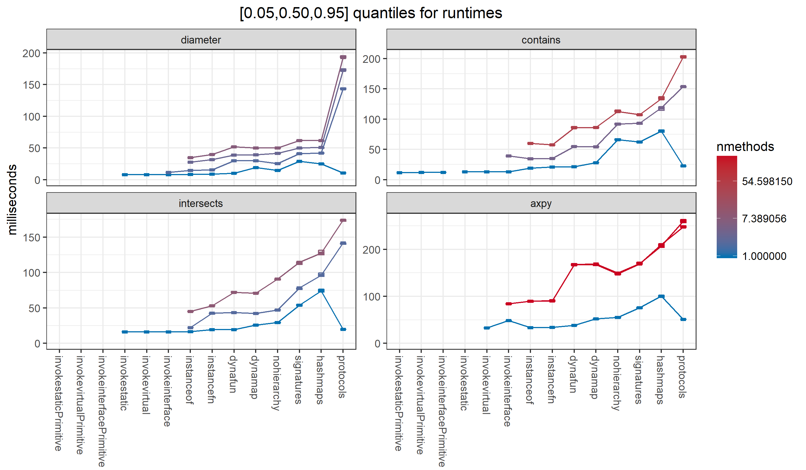
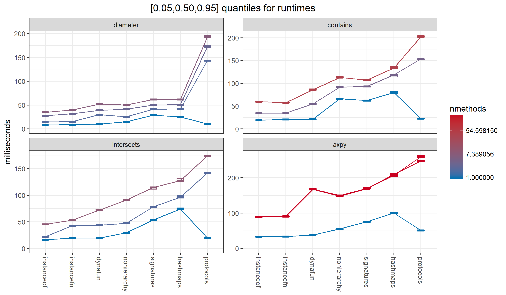
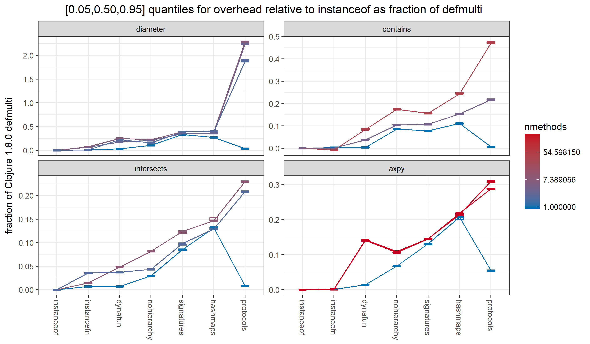

# multimethod benchmarks

A benchmark for multimethods (or anything else) only matters to you
if the pattern of use it embodies is similar to yours.

In particular, the amount of method lookup overhead you can 
tolerate depends on the cost of the operation.
So far, I'm getting roughly 500ns for Clojure 1.8.0 multimethod lookup;
if you are using Clojure's multimethods to invoke methods
that take milliseconds to run, the Clojure 1.8.0 implementation
is fine.

The results here are from 4 benchmarks, 
reflecting my interests.
I believe they are reasonably representative
of generic operations commonly encountered 
in numeric/scientific/geometric computing,
but that's just one computing domain.
Suggestions for benchmarks from other domains would be appreciated.
 
I'm interested in using multimethods for basic basic geometric
computation. Many important methods will just be a few floating
point operations, costing perhaps 10-100 nanoseconds. 
The first 4 benchmarks (see below) are designed to reflect this.

[Criterium](https://github.com/hugoduncan/criterium)
is used to run the benchmarks, producing quantile intervals
as well as the mean.
Despite the work Criterium does to stabilize the results,
I've found typically about a 10% variation in the mean
from run to run, much more than would be expected if the
Criterium samples were close to independent and identically 
distributed. _I don't know why this is, and would appreciate 
suggestions. One possibility is that it is related to
temperature dependent cpu clock throttling,
but I haven't had the chance to explore this in depth._

The bottom line is that differences in the results less than 10%
or so shouldn't be taken seriously, 
which is no doubt true in any case.

## general assumptions

Current assumptions underlying my choice of benchmarks.

- I want to use generic operations for everything. 
An ideal language would permit defining new methods for 
`(+ a b)` without losing any performance when `a` and `b` are 
primitive `int`. (Lexical type hints might be required, but should
have minimal scope and affect only performance and not semantics,
except when used to generate validating assertions.)

- Methods can be added/redefined dynamically, in multiple threads,
concurrent with method lookup and invocation.

- Operations are invoked much more often than methods are defined,
at least 106 times as often.

- A typical operation has 10s of methods, less often 100s, rarely
much more.

- Concurrent performance is critical. Multi-threaded map-reduce
operations are ubiquitous.

- The correct method is usually the same as the one used in the
most recent call, or at least the most recent call in the same thread.

- Simple argument lists (no destructuring) are good enough, or, 
at least, performance is more important in that case.

- Performance for small arities (1,2,3,..) are more important than
larger ones.

- Pure class-based method definition and lookup is more important
than general hierarchies, or, at least, performance is more
critical in that case.

## 4 benchmarks

I currently have 4 benchmarks, 
all reasonably representative
of numeric/scientific/geometric computing.

Three are common operations on geometric objects,
here reduced to the 1d case of sets of numbers:

- `diameter` computes the maximum distance between any 2 elements
of a geometric set. It is a single operand generic operation.

- `contains?` checks to see if a value is an element of a set.
This is a 2 operand generic operation, with the 1st operand being
a set of some kind, and the 2nd a potential element.
The first operand will always be an object reference; 
the second may be primitive. 

- `intersects` checks to see if 2 set-like objects overlap.
It is another 2 operand operation; both operands will always be
object references

I have so far only implemented 1d sets, that is,
sets of numbers. 7 types of set are supported: intervals where
the endpoints are specified using one of the 6 Java primitive
number types (eg `int`, `double`, etc.) and instances of
`java.util.Set` where the elements happen to all be instances of
`Number`. 

The 4th benchmark is a common operation in numerical analysis/optimization,
called `axpy` (for a*x + y) from the venerable Fortran
[BLAS](http://dl.acm.org/citation.cfm?doid=355841.355847)
subroutine name.

`axpy` has 3 operands. n the general case, `a` is linear function from a linear space
*X* to a linear space *Y*; `x` is an element of *X*; and 
`y` is an element of *Y*, and the return value is an element of *Y*.
In pseudo-clojure, we might write `axpy` as `(+ (a x) y)`.

For the benchmark, I've implemented the 2d case.
I've provided 6 implementations for vectors in 
<b>R</b>2, one for each of the primitive number types.
For linear functions, I've provided 6 implementations of 2x2
matrices, again, one for each of the primitive number types.

Vectors and matrices with, eg, `short` coordinates is not terribly
realistic. I provide implementations here for all the primitive
number types because it makes it easy to generate code
for a case with 6x6x6=216 methods, much more than the previous 
benchmarks.

The benchmarks evaluate the performance of different _algorithms_
for method lookup on a variety of _datasets_.

### algorithms

Each of the benchmarks is given Java method lookup
algorithms that assume operand types are known 
at compile time, and which result in 
`invokestatic`, `invokevirtual`, and `invokeinterface`
JVM bytecodes.

All are given a fully dynamic Java algorithm 
using if-then-else with `instanceof` to 
cast the operands and invoke the right method.
The if-then-else tree is hand-optimized for a particular dataset
that needs repeated calls to a single method.

Each benchmark has fully dynamic algorithms using 
Clojure 1.8.0 multimethod (`defmulti`) and 5 alternatives,
testing incremental changes to Clojure 1.8.0:
- `hashmaps`: the same as Clojure 1.8.0 except it uses 
`java.util.Hashmap` for the method lookup tables instead of
`clojure.lang.PersistentHashMap`.

- `nonvolatile`: makes the `methodCache` non-`volatile`.

- `signatures`: uses instances of specialized `Signature` classes
instead of `PersistentVector` as dispatch values.

- `nohierarchy`: uses a version of `clojure.lang.MultiFn` 
that doesn't support general hierarchies, eliminating the need to 
synchronize with the shared mutable hierarchy before every
method call.

- `dynafun`: the previous method lookup algorithms are all 
backwards compatible with Clojure 1.8.0. `dynafun` abandons
compatibility to enable further optimization. 
It is currently just a simplified version
of `nohierarchy`, but changes are expected.

### datasets

The benchmarks take as input _datasets_.
A dataset is a tuple of arrays of operands,
1, 2, or 3 arrays, depending on the number of operands to the
generic operation being tested.
The operation is called in a loop iterating over the arrays, 
with one operand coming from each array.
The results are accumulated by counting (`contains` and `intersects`),
maximum (`diameter`), and maximum L1 norm (`axpy`).

The datasets differ in whether all
elements of each array are the same type, 
the element type is chosen in some deterministic pattern,
or the element type is chosen at random,
giving different probabilities for invoking the same method
repeatedly, checking the performance of various 
method caching strategies
with differing probabilities of cache hit/miss.

Each operand array is generated with a `dataset-generator` and
an `element-generator`. The `element-generator` creates 
individual operand values, either pseudo-randomly 
or deterministically, producing varying patterns of repeated
methods. The `dataset-generator` permits holding the
individual operands in varying containers, eg, arrays with 
different element types, lists, etc.

### concurrency

The benchmarks are actually run on `nthreads` sets of arrays,
concurrently in `nthreads` threads, 
because it's not realistic to assume a multimethod will be called 
in a single thread, and
contention for shared mutable method tables might have a significant
effect, depending on implementation.

The [default](https://github.com/palisades-lakes/palisades/lakes/bench/blob/master/src/main/clojure/palisades/lakes/bench/core.clj#L42)
 for `nthreads` is 
`(max 1 (- (.availableProcessors (Runtime/getRuntime)) 2))`,
the idea being to leave one physical cpu free for system tasks,
gc, etc., perhaps reducing the variation in time between runs.

## Results

The main benchmark script is 
[palisades.lakes.multix.scripts.bench](https://github.com/palisades-lakes/multimethod-experiments/blob/master/src/scripts/clojure/palisades/lakes/multix/all.clj).

The results that follow are from a Thinkpad P70 (Xeon E3-1505M v5).

The plots show 90% interval boxes for the runtimes for 
all 6 concurrent runs over
operand arrays of length 222 (4194304).
Results from a given dataset are joined by lines.
The boxes and the lines are colored according to the number of
different methods (`nmethods`) required by the operands in the dataset, 
ranging from 1 to 216. In all cases, the operand types are chosen
with equal probability from some finite set, so the probability
of a repeated call to the same method is `(/ 1 nmethods)`.

Excluding Clojure 1.8.0 (`defmulti`):

The baseline algorithms by themselves:

All the fully dynamic algorithms:

Excluding Clojure 1.8.0 to make the differences among
the others easier to see:

  
Taking `instanceof` as the baseline for (benchmark,dataset)
pair, the overhead as a fraction of the Clojure 1.8.0
defmulti overhead:

Excluding Clojure 1.8.0 to make the differences among
the others easier to see:

  

See [benchmarks.md](figs/benchmarks.md) for detailed results.

### conclusions

1. Small changes to the Clojure 1.8.0 implementation
greatly reduce method lookup overhead, 
making multimethods a feasible choice for many more problems.

1. There is virtually no difference among the non-dynamic
algorithms (`invokestatic`, `invokevirtual`, and `invokeinterface`). 

1. Hand-optimized `instanceof` has the same performance as the non-dynamic methods in the case of repeated
calls to the first method found in depth first if-then-else.
It may be possible for auto-tuned method lookup (either dynamic
or at code generation time) to get performance that approaches non-dynamic method choice. 

1. All the dynamic algorithms take longer as the probability of calling the same method again decreases. Improvements relative
to Clojure 1.8.0 are also less.

    The benchmarks here
(especially `axpy`) have what I believe is an unlikely number
of methods, and the datasets distribute the method calls
uniformly over those methods, which, again I believe,
is not typical. Real data would greatly help here.

1. Replacing `PersistentHashMap` with `HashMap` 
reduces method lookup overhead to 10-30% of Clojure 1.8.0.

    The improvement is least for `diameter`, a single operand operation, using `class` for the dispatch value.
Note: in this case 'nonvolatile` and 'signatures` are identical;
the dispatch value is both cases is computed with `getClass`.
The differences in performance show the level of uncertainty
left in the benchmarks after Criterium's efforts
to stabilize.

3. Making the `methodCache` non-volatile makes no difference
in this benchmark, if not actually making things worse.
It may help when there is more contention, possibly if `nthreads`
uses all available cpus.

4. Except for `diameter`, using a specialized `Signature` dispatch value in place
of a `PersistentVector` reduces the overhead by by roughly a quarter.

5. Providing a `:hierarchy false` option gets us to 3-8% of 
the overhead of Clojure 1.8.0, in the best cases.

6. The best results so far still take about twice
as long as the `instanceof` baseline,
so the _overhead_ is comparable to than the baseline cost.
So there is still room for improvement.
The next question is whether significant additional improvement
can be made at the Clojure/Java level, or if Clojure compiler
changes are needed.

### future work

- add `protocol` based algorithms

- generate datasets whose probability of repeated calls to the
same method is more typical of actual code.

- reduce the noise in the results by combining
multiple runs over different days. Requires persisting
raw Criterium output.
